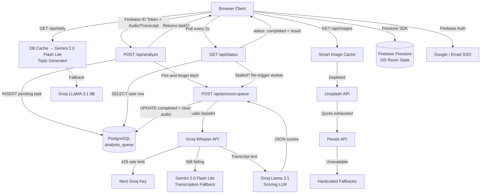
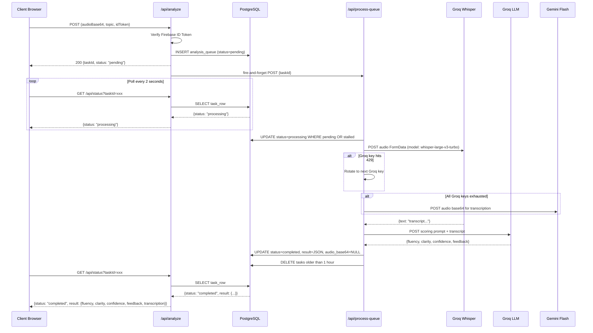
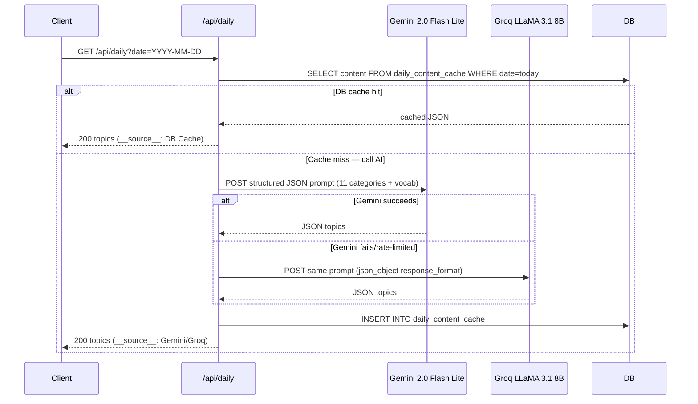

<div align="center">

# 🎤 Speak Up!

**AI-powered English speaking practice platform with real-time speech scoring, gamification, and group discussion rooms.**

[](https://opensource.org/licenses/MIT)
[](https://speakupai.me)
[](https://nodejs.org)
[](https://www.postgresql.org)
[](https://firebase.google.com)
[](https://groq.com)

**[Live Demo](https://speakupai.me)** · **[Practice Now](https://speakupai.me/practice)** · **[Group Discussion](https://speakupai.me/group-meet)**

</div>

---

## Table of Contents

- [Executive Summary](#executive-summary)
- [Key Highlights](#key-highlights)
- [Architecture Overview](#architecture-overview)
- [Technology Stack](#technology-stack)
- [Repository Structure](#repository-structure)
- [Core Components](#core-components)
- [AI Pipeline](#ai-pipeline)
- [Request Lifecycle](#request-lifecycle)
- [API Reference](#api-reference)
- [Features](#features)
- [Security Model](#security-model)
- [Performance Design](#performance-design)
- [Database Schema](#database-schema)
- [Installation & Setup](#installation--setup)
- [Environment Variables](#environment-variables)
- [Deployment](#deployment)
- [Engineering Decisions](#engineering-decisions)
- [Roadmap](#roadmap)
- [Limitations](#limitations)
- [Contributing](#contributing)
- [License](#license)

---

## Executive Summary

Speak Up! is a production-deployed, full-stack web application built to address a specific gap in English language learning: the absence of a free, accessible, AI-powered tool for **spoken** practice with measurable feedback.

The platform records a user's voice, transcribes the audio using Groq Whisper, scores the transcription across three dimensions (Fluency, Clarity, Confidence) using a Groq LLM, and persists results to a PostgreSQL database — all through an **asynchronous, fault-tolerant processing pipeline** with automatic AI provider failover.

**Why this architecture matters:**

- Speech analysis is inherently latency-heavy (5–15 seconds end-to-end). A synchronous HTTP response would time out on mobile networks. The queue-based pipeline returns a `taskId` immediately and lets the client poll for results — keeping the UX non-blocking and the server stateless.
- Using two independent AI providers (Groq + Gemini) with automatic key rotation means the platform remains operational even when any single provider hits rate limits or goes down.
- Deploying as Vercel Serverless Functions means zero infrastructure to manage, automatic horizontal scaling, and pay-per-invocation cost model.

**Who it is for:** English learners of all levels, particularly students preparing for interviews and group discussions, who need a free, always-available practice partner.

---

## Key Highlights

- **Async AI Processing Pipeline** — Task queue backed by PostgreSQL with stall detection and self-healing recovery in `/api/status`
- **Multi-Provider Failover** — Automatic Groq → Gemini fallback for both transcription and text generation, with per-key 429 rotation for Groq
- **Firebase Token Verification on Every Write** — Server-side ID token validation via Google Identity Toolkit API; no SDK dependency
- **Custom In-Memory Rate Limiter** — IP + endpoint keyed rate limiting with sliding window, stale entry cleanup, and `Retry-After` headers — no Redis required
- **Smart Image Cache** — 75-image in-memory cache across warm Vercel invocations, with async background refill and 3-layer fallback (Unsplash → Pexels → hardcoded)
- **Error Sanitization** — All internal errors (DB connection strings, stack traces, API keys) are logged server-side and replaced with generic messages before reaching the client
- **Production HTTP Security Headers** — CSP, HSTS, X-Frame-Options, X-Content-Type-Options, Referrer-Policy, and Permissions-Policy configured globally in `vercel.json`
- **Real-Time Group Discussion Rooms** — Firebase Firestore-backed multi-user rooms with spin wheel, topic approval flow, and shared countdown timer
- **PWA Support** — Service Worker + Web Manifest for installability on Android/iOS
- **Idempotent DB Startup Migrations** — `db.js` runs `ALTER TABLE ... ADD COLUMN IF NOT EXISTS` on every cold start to handle schema drift transparently

---

## Architecture Overview



### Component Interactions

| Component | Technology | Responsibility |
|---|---|---|
| Frontend | HTML5 / CSS3 / Vanilla JS | UI rendering, audio capture, Firestore real-time sync |
| Auth | Firebase Auth | Google/Email sign-in; issues ID tokens |
| Token Verification | Google Identity Toolkit REST API | Server-side token validation without Admin SDK |
| API Layer | Vercel Serverless Functions (Node.js ESM) | Business logic, DB writes, AI orchestration |
| Shared Middleware | `shared/middleware.js` | CORS, rate limiting, error sanitization, input sanitization |
| Relational DB | PostgreSQL via `pg` pool | Users, sessions, analysis queue |
| Real-time DB | Firebase Firestore | GD room state (ephemeral) |
| Speech-to-Text | Groq Whisper Large v3 Turbo | Server-side audio transcription |
| Scoring LLM | Groq Llama 3.1 8B Instant | Fluency/Clarity/Confidence evaluation |
| Daily Content | Gemini 2.0 Flash Lite → Groq LLaMA 3.1 8B | Topic and vocabulary generation (DB-cached per day) |
| Chat Tutor | Gemini 2.0 Flash Lite → Groq LLaMA 3.1 8B | Conversational English tutoring |
| Image Service | Unsplash → Pexels → Hardcoded | Picture-talk scenario images |
| CDN / Infra | Vercel (Singapore region) | Static assets + serverless execution |

---

## Technology Stack

### Frontend
- **HTML5** — Semantic markup with ARIA labels and structured heading hierarchy
- **CSS3 / Vanilla CSS** — 7-theme design system using CSS custom properties; 2,883 lines; responsive layout
- **Vanilla JavaScript** — No framework; `MediaRecorder` API for audio capture; `onAuthStateChanged` for session management

### Backend
- **Node.js (ESM)** — All API functions use ES module syntax (`import`/`export`)
- **Vercel Serverless Functions** — 11 endpoints in `/api/`, auto-scaled, Singapore region

### AI & Machine Learning
- **Groq Whisper Large v3 Turbo** — Primary speech-to-text transcription (configurable via `GROQ_WHISPER_MODEL`)
- **Groq Llama 3.1 8B Instant** — Speech scoring LLM (configurable via `GROQ_SCORING_MODEL`)
- **Groq LLaMA 3.1 8B Instant** — Daily topics and chat fallback (configurable via `GROQ_DAILY_MODEL`, `GROQ_CHAT_MODEL`)
- **Google Gemini 2.0 Flash Lite** — Primary daily topic generator, chat tutor, and audio transcription fallback

### Authentication
- **Firebase Auth** — Client-side Google and Email/Password sign-in
- **Google Identity Toolkit REST API** — Stateless server-side token verification (`/v1/accounts:lookup`)

### Databases
- **PostgreSQL** (`pg` v8.11.3) — Relational store for users, practice sessions, and analysis queue; pool size capped at 3 for serverless connection budgets
- **Firebase Firestore** — Real-time document store for group discussion room state

### Image Providers
- **Unsplash API** — Primary image source (150+ curated landscape queries)
- **Pexels API** — Fallback image source using the same query set
- **Hardcoded fallback images** — Stable Unsplash URLs requiring no API key

### Infrastructure & Deployment
- **Vercel** — Hosting, serverless execution, CI/CD (`git push` → auto-deploy)
- **GitHub** — Version control and source of truth for deployments

### Browser APIs Used
- `MediaRecorder` — Audio capture (mono, with echo/noise suppression for cleaner Whisper input)
- `Service Worker` — Offline caching
- `Web App Manifest` — PWA installability

### Developer Tools
- `firebase-admin` v12 (devDependency) — Used only in build scripts
- `vercel` v37 (devDependency) — Local dev server (`vercel dev`)

---

## Repository Structure

```
speak-up/
├── api/                        # Vercel Serverless Functions (11 endpoints)
│   ├── analyze.js              # Enqueues analysis task; triggers background worker
│   ├── chat.js                 # Conversational English tutor (Gemini → Groq fallback)
│   ├── check-username.js       # Username availability check
│   ├── daily.js                # AI daily topic + vocabulary generator
│   ├── get-public-profile.js   # Public /u/:username profile endpoint
│   ├── get-user.js             # Authenticated user profile + sessions fetch
│   ├── images.js               # Smart cached image service (Unsplash/Pexels)
│   ├── process-queue.js        # Background worker: transcription + scoring + DB write
│   ├── save-session.js         # Persist practice session + update streak/aura
│   ├── status.js               # Task status polling with stall detection
│   └── update-profile.js       # Update user profile fields
│
├── shared/                     # Shared modules imported by API functions
│   ├── auth-helper.js          # Firebase token verification via REST API
│   ├── db.js                   # PostgreSQL connection pool + startup migration
│   └── middleware.js           # CORS, rate limiting, error sanitization, input helpers
│
├── assets/
│   ├── css/
│   │   └── style.css           # Global stylesheet (7-theme CSS custom property system)
│   ├── js/
│   │   ├── firebase-config.js  # Firebase SDK initialization
│   │   ├── page-transitions.js # Smooth page navigation with progress bar
│   │   └── whisper-worker.js   # Web Worker for client-side Whisper (optional path)
│   ├── images/
│   │   ├── icon-192.png        # PWA icon
│   │   ├── icon-512.png        # PWA icon
│   │   └── og-banner.png       # Open Graph social sharing image
│   └── manifest.json           # PWA Web Manifest
│
├── database/
│   └── schema.sql              # PostgreSQL DDL: 3 tables, 4 indexes, migration notes
│
├── scripts/                    # Build and utility scripts (not deployed)
│
├── index.html                  # Landing page
├── practice.html               # Core practice interface
├── genz-streak-test.html       # User dashboard (routed as /dashboard)
├── group-meet.html             # Real-time group discussion room
├── about.html                  # About page
├── login.html                  # Login page (noindex)
├── signup.html                 # Signup page (noindex)
├── privacy.html                # Privacy Policy
├── terms.html                  # Terms of Service
├── 404.html                    # Custom animated 404 page
├── sw.js                       # Service Worker for PWA caching
├── robots.txt                  # Search crawler directives
├── sitemap.xml                 # XML sitemap with priority ratings
├── vercel.json                 # Vercel config: security headers, rewrites, region
├── package.json                # Dependencies + npm scripts
├── AI_MODERATION_DESIGN.md     # Future feature design spec
└── PITCH_DOCUMENT.md           # Project pitch document
```

---

## Core Components

### `shared/middleware.js`

The backbone of API security and observability. Imported by all 11 API functions.

| Export | Purpose |
|---|---|
| `setCorsHeaders(req, res)` | Enforces origin whitelist from `ALLOWED_ORIGINS`; attaches a unique `X-Request-Id` per request for log correlation |
| `checkRateLimit(req, res, opts)` | In-memory sliding-window rate limiter keyed on `IP:endpoint`; returns `false` and sends `429` if over limit |
| `safeError(res, code, err, prefix)` | Logs full error server-side; returns only a generic status message to the client |
| `sanitizeString(input, maxLen)` | Trims and truncates string inputs |
| `clampInt(value, min, max)` | Clamps numeric inputs to a safe range |
| `getWorkerSecret()` | Returns `WORKER_SECRET` for internal `X-Worker-Secret` header |
| `verifyWorkerSecret(req)` | Validates the `X-Worker-Secret` header on protected worker endpoints |

### `shared/db.js`

PostgreSQL connection pool tuned for a serverless environment:

- Pool `max: 3` — prevents connection exhaustion across concurrent cold-start invocations
- `idleTimeoutMillis: 15000` — aggressive recycling to free connections quickly
- SSL auto-enabled for non-localhost connection strings
- **Startup migration** — `ALTER TABLE ... ADD COLUMN IF NOT EXISTS` runs on every cold start to handle schema evolution transparently

### `shared/auth-helper.js`

Verifies Firebase ID tokens using the Google Identity Toolkit REST API (`/v1/accounts:lookup`). Deliberately avoids `firebase-admin` as a runtime dependency to keep the cold-start bundle minimal.

### `api/analyze.js`

**Entry point for speech analysis.** Accepts audio (base64) or a pre-computed transcript, validates the Firebase ID token, inserts a `pending` task into `analysis_queue`, fires the background worker as a non-blocking `fetch`, and returns the `taskId` immediately. Rate-limited to 5 requests/minute per IP.

### `api/process-queue.js`

**The AI processing worker.** Atomically locks a task row using a conditional `UPDATE ... WHERE status = 'pending' OR (status = 'processing' AND updated_at < NOW() - INTERVAL '15 seconds')` — preventing duplicate execution across concurrent invocations. Then:

1. Transcribes audio via Groq Whisper with multi-key rotation on 429s
2. Falls back to Gemini 1.5 Flash audio transcription if all Groq keys fail
3. Validates transcript length (rejects < 3 words)
4. Scores via Groq Llama 3.1 with the same key rotation
5. Parses and sanitizes the LLM JSON response
6. Saves the result and **clears `audio_base64`** to prevent unbounded DB growth
7. Prunes completed/failed tasks older than 1 hour

### `api/status.js`

**Polling endpoint with self-healing.** On each poll, if the task is still `pending` or has been `processing` for > 12 seconds (stall detection), it synchronously calls the worker itself — functioning as a fallback trigger if the original fire-and-forget failed due to a Vercel cold-start collision.

### `api/daily.js`

Generates 11 topic categories + 8 interview questions + 10 vocabulary items per day using a structured JSON prompt.

1. **DB Cache check first** — Queries `daily_content_cache` table for today's date. If found, returns instantly with zero AI cost.
2. **Gemini 2.0 Flash Lite** — Cheapest/fastest model; more than sufficient for topic generation.
3. **Groq LLaMA 3.1 8B fallback** — ~10× cheaper than the previous 70B fallback with no quality loss for structured JSON.
4. **DB Cache write** — Saves the generated content so all subsequent requests (including Vercel cold-starts) skip the AI call entirely.

The CDN `Cache-Control` header (`s-maxage=86400, stale-while-revalidate=43200`) provides an additional Edge-level cache layer.

### `api/images.js`

**Smart in-memory image cache.** Module-level `imageCache` array persists across warm invocations in the same Vercel instance. Serves images with a `usedIndices` rotation to avoid repetition. Triggers a background async refill when supply drops below 15. Falls back through Unsplash → Pexels → hardcoded stable URLs.

---

## AI Pipeline

### Speech Analysis (Async Queue)



### Daily Content Generation



---

## Request Lifecycle

**Example: User records speech, receives AI score**

1. **Client** captures audio via `MediaRecorder API` in the browser
2. **Client** encodes audio to base64, gets a Firebase ID token via `auth.currentUser.getIdToken()`
3. **Client** `POST /api/analyze` with `{audioBase64, topic, idToken, mimeType}`
4. **`/api/analyze`** validates CORS origin, checks rate limit (5/min), verifies Firebase token server-side
5. **`/api/analyze`** inserts a `pending` row into `analysis_queue` with a `crypto.randomUUID()` taskId
6. **`/api/analyze`** fires a non-blocking `fetch` to `/api/process-queue` (with `X-Worker-Secret` header) and returns `{taskId}` to the client
7. **Client** begins polling `GET /api/status?taskId=xxx` every 2 seconds
8. **`/api/process-queue`** atomically claims the task (conditional `UPDATE` to prevent duplicate processing)
9. Worker builds a `FormData` payload, sends to Groq Whisper; rotates keys on 429; falls back to Gemini if all keys fail
10. Transcript is length-validated; if < 3 words, a graceful "too short" result is stored immediately
11. Scoring prompt is sent to Groq Llama 3.1 (using the key that worked for Whisper); output JSON is parsed and sanitized
12. Result is stored to `analysis_queue`; `audio_base64` is set to `NULL` to free storage
13. **`/api/status`** returns `{status: "completed", result: {fluency, clarity, confidence, feedback, transcription}}`
14. **Client** displays scores; calls `POST /api/save-session` to persist the result and update streak/aura

---

## API Reference

All endpoints apply CORS validation, attach a unique `X-Request-Id` header, and return generic error messages for server-side failures.

### Speech Analysis

| Method | Endpoint | Auth | Rate Limit | Description |
|---|---|---|---|---|
| `POST` | `/api/analyze` | Firebase ID Token | 5/min | Enqueue speech analysis task |
| `GET` | `/api/status` | None | 30/min | Poll task status; returns result when complete |
| `POST` | `/api/process-queue` | Worker Secret Header | Internal | Background worker: transcribe + score + persist |

<details>
<summary><code>POST /api/analyze</code> — Request / Response</summary>

**Request body**
```json
{
  "idToken": "firebase-id-token",
  "audioBase64": "base64-encoded-audio...",
  "mimeType": "audio/webm",
  "topic": "Is remote work better than office work?",
  "imageUrl": "https://..." 
}
```
> Either `audioBase64` or `transcript` must be present. `imageUrl` is optional (used for picture-talk context in Gemini scoring).

**Response `200`**
```json
{ "taskId": "550e8400-e29b-41d4-a716-446655440000", "status": "pending" }
```
</details>

<details>
<summary><code>GET /api/status?taskId=xxx</code> — Response states</summary>

**`processing`**
```json
{ "status": "processing" }
```
**`completed`**
```json
{
  "status": "completed",
  "result": "{\"fluency\":78,\"clarity\":82,\"confidence\":71,\"feedback\":\"Great job!\",\"transcription\":\"I think remote work is...\"}"
}
```
**`failed`**
```json
{ "status": "failed", "error": "Transcription failed on all Groq keys..." }
```
</details>

---

### User Management

| Method | Endpoint | Auth | Rate Limit | Description |
|---|---|---|---|---|
| `POST` | `/api/get-user` | Firebase ID Token | Default | Fetch user profile, practice dates, sessions, rank |
| `POST` | `/api/save-session` | Firebase ID Token | 10/min | Persist session; update streak, aura, yap count |
| `POST` | `/api/update-profile` | Firebase ID Token | 5/min | Update name, gender, avatar, social URLs, username |
| `GET` | `/api/check-username` | None | Default | Check username availability |
| `GET` | `/api/get-public-profile` | None | Default | Fetch public profile by username |

<details>
<summary><code>POST /api/save-session</code> — Request / Response</summary>

**Request body**
```json
{
  "idToken": "firebase-id-token",
  "uid": "firebase-uid",
  "sessionData": {
    "topic": "Climate Change",
    "mode": "random",
    "fluency": 78,
    "clarity": 82,
    "confidence": 71
  }
}
```
**Response `200`**
```json
{ "ok": true, "streak": 7, "aura": 120 }
```
</details>

---

### Content Generation

| Method | Endpoint | Auth | Rate Limit | Description |
|---|---|---|---|---|
| `GET` | `/api/daily` | None | 5/min | Generate daily topics, interview questions, vocabulary |
| `GET` | `/api/images` | None | 20/min | Serve a random picture-talk image from cache |
| `POST` | `/api/chat` | Firebase ID Token | 20/min | Conversational English tutor (Gemini → Groq fallback) |

<details>
<summary><code>GET /api/daily</code> — Response shape</summary>

```json
{
  "random": {
    "general":    [{ "above": "...", "main": "...", "below": "...", "difficulty": "easy" }],
    "tech":       [...],
    "finance":    [...],
    "roast":      [...],
    "pitch":      [...],
    "defend":     [...],
    "eli5":       [...],
    "conspiracy": [...],
    "hottakes":   [...],
    "millennial": [...],
    "genz":       [...]
  },
  "interview": [{ "above": "...", "main": "...", "below": "...", "difficulty": "medium" }],
  "vocab": [{ "word": "...", "pos": "noun", "meaning": "...", "example": "...", "angle": "..." }],
  "__source__": "Gemini (Flash Latest)"
}
```
</details>

---

## Features

### Practice Modes

| Mode | Description |
|---|---|
| **Random Topics** | 11 category sub-types (general, tech, finance, roast, pitch, defend, eli5, conspiracy, hot takes, millennial, gen-z) — refreshed daily by Gemini/Groq |
| **Interview Prep** | 8 STAR-method behavioral questions per day |
| **Vocabulary Builder** | 10 words/idioms/phrases with meaning, POS, example, and a prompt angle |
| **Picture Talk** | Describe a high-quality contextual image; Gemini scores using image + transcript together |
| **Group Discussion Rooms** | Real-time multi-user voice rooms via Jitsi Meet with topic spin wheel, participant approval flow, shared timer, and Firebase Firestore room state |

### Recording Quality

- **15-second minimum** — Submissions shorter than 15 seconds are rejected client-side with a friendly message, ensuring the AI receives enough speech to give meaningful scores
- **Mono audio capture** — `MediaRecorder` requests `channelCount: { ideal: 1 }`, reducing audio payload size ~50% for faster uploads
- **Noise & echo suppression** — `noiseSuppression: true` and `echoCancellation: true` constraints produce cleaner audio, reducing Whisper transcription errors
- **Auto gain control** — Normalises microphone volume for consistent transcription regardless of mic distance

### Gamification

- **Streaks** — Consecutive daily practice days tracked in PostgreSQL; reset if a day is missed
- **Aura Points** — +10 per session; used for global rank calculation (`SELECT COUNT(*) + 1 FROM users WHERE aura_points > ?`)
- **Total Yaps** — Lifetime session count
- **Activity Heatmap** — GitHub-style calendar rendered from `practice_dates` returned by `/api/get-user`
- **Performance Badges** — Threshold-based badge unlock system rendered client-side

### Profile & Social

- **Public Profiles** — Accessible at `/u/:username`
- **Custom Username** — Unique, case-insensitive (enforced via `LOWER(username)` index), 3–20 alphanumeric/underscore characters
- **DiceBear Avatars** — Generated from `avatar_seed` and `avatar_bg` color fields
- **Social Links** — LinkedIn and Instagram URL fields with `https://` protocol validation

### UI/UX

- **7 Color Themes** — Pink, Green, Blue, Purple, Teal, Orange, Dark; persisted to `localStorage`
- **Smooth Page Transitions** — CSS animation + top progress bar on navigation
- **PWA** — Installable on Android/iOS; Service Worker for offline capability
- **Fully Responsive** — Mobile-first CSS with breakpoints at 480px and 992px
- **Custom 404 Page** — Animated branded error page

---

## Security Model

### HTTP Security Headers (global via `vercel.json`)

| Header | Value |
|---|---|
| `X-Frame-Options` | `DENY` |
| `X-Content-Type-Options` | `nosniff` |
| `Referrer-Policy` | `strict-origin-when-cross-origin` |
| `Strict-Transport-Security` | `max-age=63072000; includeSubDomains; preload` |
| `Content-Security-Policy` | Full policy restricting `script-src`, `style-src`, `font-src`, `img-src`, `connect-src`, `frame-src`, `worker-src`, `media-src` to known-good origins |
| `Permissions-Policy` | Camera/microphone restricted to `self` + trusted Jitsi domains; geolocation, payment, gyroscope disabled |

### API Security

- **CORS Origin Lock** — `setCorsHeaders()` enforces `ALLOWED_ORIGINS` whitelist; rejects unrecognized browser origins
- **Firebase Token Verification** — Every write endpoint calls `verifyFirebaseIdToken()` and cross-checks the returned `uid` against the claimed `uid` in the request body
- **Worker Secret** — `/api/process-queue` rejects requests missing the `X-Worker-Secret` header when `WORKER_SECRET` is configured
- **Rate Limiting** — Per-IP, per-endpoint sliding window; limits range from 5/min (analyze) to 30/min (status polling)
- **Input Sanitization** — All string inputs trimmed and truncated via `sanitizeString()`; numeric inputs clamped via `clampInt()`; avatar hex codes stripped of non-hex characters; social URLs validated for `https://` protocol

### Data Handling

- Audio base64 stored temporarily in `analysis_queue.audio_base64` and set to `NULL` immediately after successful processing — not retained
- Raw error messages (DB stack traces, API error bodies) never leave the server; `safeError()` maps them to generic HTTP status messages

---

## Performance Design

### Asynchronous AI Processing
The single largest UX win. Returning a `taskId` immediately (< 50ms) instead of blocking for 5–15 seconds makes the app usable on slow mobile connections. The client polls at 2-second intervals while a loading indicator runs.

### In-Memory Image Cache
Vercel keeps function instances warm for several minutes. The module-level `imageCache` array persists across requests within the same warm instance — effectively providing free in-process caching with no external dependency. A background async refill fires when stock drops below 15, so cache misses never block a user response.

### DB-Level Daily Content Cache
The new `daily_content_cache` PostgreSQL table stores generated topics keyed by date. On every `/api/daily` request, the DB is checked first — the AI is only called **once per calendar day** regardless of how many Vercel cold-starts occur or how many users visit. This eliminates the largest source of redundant AI spending.

### Edge Caching for Daily Topics
`/api/daily` sets `Cache-Control: public, s-maxage=86400, stale-while-revalidate=43200`. Vercel's Edge Network provides an additional cache layer on top of the DB cache.

### Database Indexing

```sql
-- Covers user session queries ordered by recency
CREATE INDEX idx_sessions_user_date ON practice_sessions(user_id, date DESC);

-- Covers worker poll: "find oldest pending task"
CREATE INDEX idx_queue_status_created ON analysis_queue(status, created_at);

-- Case-insensitive unique username lookup
CREATE UNIQUE INDEX idx_users_username ON users(LOWER(username)) WHERE username IS NOT NULL;
```

### Connection Pool Sizing
PostgreSQL pool `max: 3` is intentional for serverless. Each Vercel invocation gets one connection; with 3 concurrent warm instances, this uses 3 connections total — well within free-tier managed DB limits.

### Stale Entry Cleanup
The rate limiter's in-memory `rateLimitStore` cleans entries older than 2 minutes at most once per minute, preventing unbounded memory growth in long-lived warm instances.

---

## Database Schema

```sql
-- Users
CREATE TABLE IF NOT EXISTS users (
    uid          VARCHAR(128)  PRIMARY KEY,
    name         VARCHAR(255)  NOT NULL,
    email        VARCHAR(255)  UNIQUE NOT NULL,
    gender       VARCHAR(50)   DEFAULT 'prefer_not',
    avatar_bg    VARCHAR(50)   DEFAULT 'b6e3f4',
    avatar_seed  VARCHAR(100)  DEFAULT 'Felix',
    aura_points  INTEGER       DEFAULT 0,
    streak       INTEGER       DEFAULT 0,
    total_yaps   INTEGER       DEFAULT 0,
    linkedin_url VARCHAR(255),
    instagram_url VARCHAR(255),
    username     VARCHAR(20)   UNIQUE,
    created_at   TIMESTAMPTZ   DEFAULT CURRENT_TIMESTAMP
);

-- Practice Sessions
CREATE TABLE IF NOT EXISTS practice_sessions (
    id         SERIAL        PRIMARY KEY,
    user_id    VARCHAR(128)  REFERENCES users(uid) ON DELETE CASCADE,
    date       TIMESTAMPTZ   DEFAULT CURRENT_TIMESTAMP,
    topic      VARCHAR(255)  NOT NULL,
    mode       VARCHAR(50)   NOT NULL,
    score      INTEGER       NOT NULL,   -- average of fluency, clarity, confidence
    fluency    INTEGER       NOT NULL,
    clarity    INTEGER       NOT NULL,
    confidence INTEGER       NOT NULL
);

-- AI Analysis Task Queue
CREATE TABLE IF NOT EXISTS analysis_queue (
    task_id      VARCHAR(128)  PRIMARY KEY,
    status       VARCHAR(50)   DEFAULT 'pending',   -- pending | processing | completed | failed
    transcript   TEXT,
    audio_base64 TEXT,                               -- cleared after processing
    mime_type    VARCHAR(100),
    topic        VARCHAR(255),
    image_url    TEXT,
    result       TEXT,                               -- JSON string of final analysis
    error_message TEXT,
    created_at   TIMESTAMPTZ   DEFAULT CURRENT_TIMESTAMP,
    updated_at   TIMESTAMPTZ   DEFAULT CURRENT_TIMESTAMP
);

-- Performance Indexes
CREATE INDEX        idx_sessions_user_date  ON practice_sessions(user_id, date DESC);
CREATE INDEX        idx_queue_status_created ON analysis_queue(status, created_at);
CREATE UNIQUE INDEX idx_users_username       ON users(LOWER(username)) WHERE username IS NOT NULL;

-- Daily Content Cache (eliminates redundant AI calls)
CREATE TABLE IF NOT EXISTS daily_content_cache (
    date        DATE          PRIMARY KEY,
    content     JSONB         NOT NULL,
    created_at  TIMESTAMPTZ   DEFAULT CURRENT_TIMESTAMP
);
CREATE INDEX idx_daily_cache_date ON daily_content_cache(date DESC);
```

---

## Installation & Setup

### Prerequisites

- Node.js ≥ 18
- A PostgreSQL database (Supabase, Neon, or self-hosted)
- A Firebase project with Authentication enabled (Google provider)
- A Vercel account (free Hobby tier is sufficient)
- A Groq API key (free tier available at [console.groq.com](https://console.groq.com))
- A Google Gemini API key (free tier available at [aistudio.google.com](https://aistudio.google.com))

### Local Development

```bash
# 1. Clone the repository
git clone https://github.com/pavandoddavarapu/english-project-testing.git
cd english-project-testing

# 2. Install dependencies
npm install

# 3. Configure environment variables
cp .env.example .env
# Edit .env with your actual values (see Environment Variables section)

# 4. Apply database schema
# Run database/schema.sql in your PostgreSQL instance (psql or Supabase SQL editor)

# 5. Start the local development server
npm run dev
# Runs: node scripts/build.js && vercel dev
```

---

## Environment Variables

| Variable | Required | Description |
|---|---|---|
| `DATABASE_URL` or `POSTGRES_URL` | ✅ | PostgreSQL connection string. Either variable name is accepted. |
| `GROQ_API_KEY` | ✅ | One or more Groq API keys, comma-separated. Multiple keys enable automatic rotation on rate limits. Example: `gsk_key1,gsk_key2` |
| `GEMINI_API_KEY` | ✅ | Google Gemini API key. Used for daily content (primary), chat, and audio transcription fallback. |
| `ALLOWED_ORIGINS` | ✅ (production) | Comma-separated list of allowed CORS origins. If unset, all origins are allowed (development mode). |
| `WORKER_SECRET` | Recommended | Shared secret for `X-Worker-Secret` header. Protects `/api/process-queue` from external calls. |
| `UNSPLASH_ACCESS_KEY` | Optional | Unsplash API key for picture-talk images. Falls back to Pexels if absent. |
| `PEXELS_API_KEY` | Optional | Pexels API key. Used when Unsplash is absent or quota-exhausted. |
| `GROQ_WHISPER_MODEL` | Optional | Override Whisper model. Defaults to `whisper-large-v3-turbo`. |
| `GROQ_SCORING_MODEL` | Optional | Override scoring LLM. Defaults to `llama-3.1-8b-instant`. |
| `GROQ_DAILY_MODEL` | Optional | Override daily topics LLM. Defaults to `llama-3.1-8b-instant`. |
| `GROQ_CHAT_MODEL` | Optional | Override chat LLM. Defaults to `llama-3.1-8b-instant`. |

---

## Deployment

The project is configured for zero-configuration Vercel deployment.

```bash
# Deploy to production
npm run deploy
# Runs: node scripts/build.js && vercel --prod

# Or push to main branch for automatic deployment
git push origin main
```

**Vercel configuration (`vercel.json`):**
- `"regions": ["sin1"]` — Singapore region for low latency to South/Southeast Asian users
- `"cleanUrls": true` — Strips `.html` extension from all page URLs
- `"rewrites"` — `/dashboard` → `/genz-streak-test`
- Global security headers applied to all routes via `"source": "/(.*)"` header rule

**No Docker configuration exists in this project.** Deployment is entirely managed by Vercel.

---

## Engineering Decisions

### Why vanilla JavaScript instead of a frontend framework?

The primary user base is mobile users in emerging markets where network conditions are variable. A vanilla JS frontend eliminates framework parse/evaluate overhead (~100–200ms for React), ensuring first meaningful paint is fast regardless of connection speed. Each page only loads the JavaScript it actually needs — there is no shared bundle.

### Why two databases (PostgreSQL + Firebase Firestore)?

These databases solve different problems and are not interchangeable:

- **PostgreSQL** is used for structured, relational, persistent data that requires joins, aggregation, and ordered queries (user profiles, session history, analysis queue). Firestore cannot efficiently run `SELECT COUNT(*) FROM users WHERE aura_points > ?` for live rank calculation.
- **Firebase Firestore** is used for ephemeral, real-time collaborative state (GD room participants, current topic, approval votes, timer). Its WebSocket-based `onSnapshot` listener delivers sub-second updates to all room participants. Replicating this with PostgreSQL would require polling or a separate WebSocket server.

### Why the async queue pattern instead of a synchronous AI call?

Speech analysis via Groq Whisper + LLM scoring takes 5–15 seconds. A synchronous serverless invocation holding an HTTP connection open for 15 seconds:
1. Would time out on many mobile networks (default browser timeout varies)
2. Would consume Vercel function compute time needlessly while waiting on external API I/O
3. Would fail completely if the AI provider responds slowly

The queue approach decouples submission from processing. The client receives a `taskId` in < 100ms, shows a loading state, and polls `/api/status` every 2 seconds until the result is ready.

### Why Groq over OpenAI for transcription?

Groq uses custom hardware (LPU) for inference, making Whisper transcription significantly faster than OpenAI's Whisper API at comparable pricing. On free-tier usage, the latency difference directly impacts user experience.

### Why `firebase-admin` is only a `devDependency`?

The `firebase-admin` SDK adds significant bundle weight and initialization time. Server-side Firebase ID token verification is instead performed via the lightweight `google-identity-toolkit` REST API (`/v1/accounts:lookup`), which requires only a public API key and a standard `fetch` call — keeping serverless cold-start times minimal.

---

## Roadmap

### ✅ Implemented
- Async AI speech analysis pipeline with PostgreSQL task queue
- Multi-provider failover (Groq → Gemini) for transcription and text generation
- Multi-key Groq API rotation on 429 rate limits
- Firebase ID token verification on all write endpoints
- Custom IP-based rate limiting with per-endpoint configuration
- Error sanitization (no internal details exposed to client)
- Production HTTP security headers (CSP, HSTS, Permissions-Policy, etc.)
- Real-time group discussion rooms with Firestore
- Smart image cache with 3-layer fallback
- 7-theme CSS design system
- Gamification: streaks, aura points, activity heatmap, badges
- Public user profiles (`/u/:username`)
- PWA: Service Worker + Web Manifest
- SEO: 6 JSON-LD schemas, sitemap, canonical URLs, OG/Twitter cards
- Privacy Policy and Terms of Service pages
- Custom 404 page
- **PostgreSQL DB cache for daily content** — AI called once per day max; all cold-starts served instantly from DB
- **15-second minimum recording** — Client-side guard ensures meaningful audio for accurate AI scoring
- **Mono audio capture with noise/echo suppression** — ~50% smaller uploads; cleaner Whisper transcription
- **Cheaper AI models for non-scoring tasks** — `gemini-2.0-flash-lite` for daily/chat; `llama-3.1-8b-instant` for all Groq text tasks
- **Trimmed scoring prompts** — `max_tokens: 250` (down from 400); shorter system prompt reduces cost on every analysis
- **Reduced chat history window** — Last 10 messages (down from 20) halves chat input token cost

### 🚧 Documented / Planned
- **AI Moderation for GD Rooms** — Web Speech API transcription + Gemini toxicity scoring, with host kick/ban controls. Full architecture spec: [`AI_MODERATION_DESIGN.md`](./AI_MODERATION_DESIGN.md)
- **Custom Domain** — All canonical URL references are centralised and ready to update

### 💡 Future Work
- Global leaderboard with weekly reset
- Pronunciation scoring (phoneme-level analysis)
- Google Search Console integration and analytics
- Email digest of weekly practice stats

---

## Limitations

- **Rate limiting is per-instance, not global.** The in-memory rate limiter operates within a single warm Vercel function instance. Concurrent requests hitting different instances maintain separate stores. This is a deliberate trade-off to avoid a Redis dependency.
- **Group Discussion voice is proxied through Jitsi Meet.** Individual audio streams are not accessible from within the Jitsi iframe due to browser sandbox restrictions. AI analysis of GD speech would require a separate browser microphone capture (see `AI_MODERATION_DESIGN.md`).
- **No formal test suite.** The project does not currently include unit or integration tests. All correctness has been verified through manual testing and production observation.
- **Vercel Hobby function limit.** The free Vercel Hobby plan supports up to 12 serverless functions. The project uses all 11 slots; adding new API endpoints requires upgrading the Vercel plan or merging logic into existing handlers.
- **Daily content is AI-generated.** Topic quality depends on Gemini/Groq output. Occasionally generated topics may need manual curation for production scale.

---

## Contributing

Contributions are welcome. Please follow these guidelines:

### Getting Started

1. Fork the repository and create a branch: `git checkout -b feat/your-feature-name`
2. Set up your local environment (see [Installation](#installation--setup))
3. Make changes, test manually using `npm run dev`
4. Open a Pull Request against `main`

### Code Standards

- **Module system:** ES Modules only (`import`/`export`); no CommonJS `require()`
- **API functions:** All new endpoints must import and use `setCorsHeaders`, `checkRateLimit`, and `safeError` from `shared/middleware.js`
- **Input validation:** All user-supplied strings must pass through `sanitizeString()`; numerics through `clampInt()`
- **Authentication:** Any endpoint writing user data must verify the Firebase ID token and cross-check the `uid`
- **Error handling:** Never return raw error messages. Always use `safeError()` for 500 responses
- **Commits:** Use conventional commit format: `feat:`, `fix:`, `docs:`, `refactor:`, `chore:`

### Pull Request Process

1. Describe what problem the PR solves
2. List any new environment variables introduced
3. Note any changes to the database schema (provide migration SQL)
4. Confirm the Vercel function count stays at or below 12 (Hobby plan limit)

---

## FAQ

<details>
<summary><strong>Why does the scoring sometimes take longer than expected?</strong></summary>

The AI pipeline is asynchronous. After submission, `/api/analyze` triggers the background worker as a fire-and-forget `fetch`. If Vercel's scheduler delays that background invocation (cold start), the `/api/status` polling loop will detect the stall after 12 seconds and re-trigger the worker synchronously. Total time is typically 5–15 seconds but can extend to ~25 seconds under high cold-start conditions.
</details>

<details>
<summary><strong>What happens if both Groq and Gemini are down simultaneously?</strong></summary>

For transcription: the task is marked `failed` in the queue with the combined error message. The client displays a user-facing error. For daily topics: `/api/daily` returns a 500 with a generic error message.
</details>

<details>
<summary><strong>Is user audio stored permanently?</strong></summary>

No. Audio base64 is stored temporarily in the `analysis_queue.audio_base64` column only for the duration of processing. The worker sets this column to `NULL` immediately after transcription succeeds or fails. Tasks are also pruned from the table 1 hour after completion.
</details>

<details>
<summary><strong>How does streak calculation work?</strong></summary>

On each `/api/save-session` call, the server queries the date of the user's most recent previous session. If that date is exactly yesterday (UTC), the streak increments. If it is any earlier date, the streak resets to 1. Same-day sessions do not increment the streak.
</details>

<details>
<summary><strong>Can I self-host this project?</strong></summary>

Yes. The only Vercel-specific dependencies are the serverless function format and `vercel.json` for header/rewrite configuration. You can adapt the `/api/*.js` handlers to run as Express routes on any Node.js server. The database, Firebase Auth, and AI integrations are all provider-agnostic.
</details>

---

## License

This project is licensed under the MIT License. See [LICENSE](./LICENSE) for details.

---

## Acknowledgements

- [Groq](https://groq.com) — Hardware-accelerated LLM and Whisper inference
- [Google Gemini](https://deepmind.google/technologies/gemini/) — Multimodal AI for content generation and audio transcription fallback
- [Firebase](https://firebase.google.com) — Authentication and real-time database
- [Supabase](https://supabase.com) / [Neon](https://neon.tech) — Managed PostgreSQL
- [Unsplash](https://unsplash.com) and [Pexels](https://pexels.com) — Image APIs
- [Jitsi Meet](https://meet.jit.si) — Open-source video conferencing
- [DiceBear](https://www.dicebear.com) — Procedural avatar generation
- [Vercel](https://vercel.com) — Serverless deployment platform

---

<div align="center">

Built with purpose for English learners everywhere.

**[speakup.app](https://speakupai.me)**

</div>
